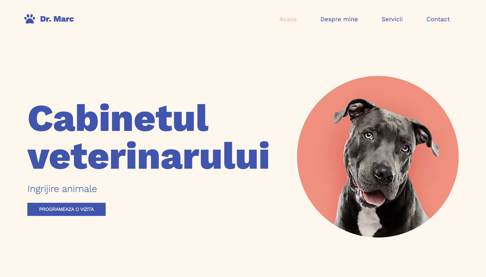
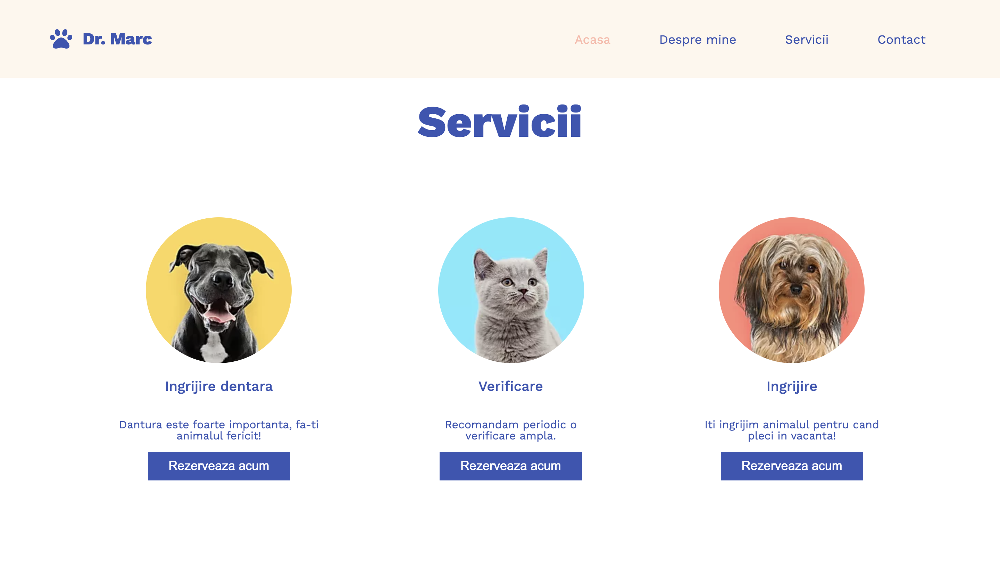
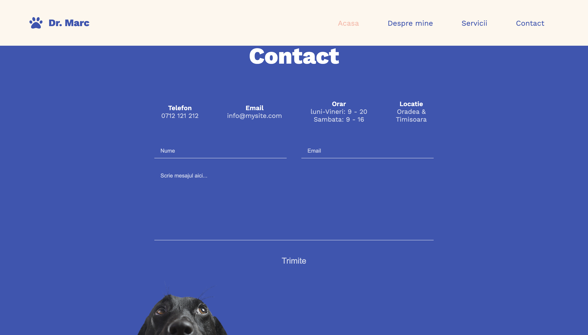

# cabinet-veterinar

This website was made for a university project.
The website presents a contact form that can be submited and it's saved on a mysql table.

This landing page was made with:
  - [html](https://www.w3schools.com/html/)
  - [css](https://www.w3schools.com/css/default.asp)
  - [javascript](https://www.w3schools.com/js/DEFAULT.asp)
  - [php](https://www.php.net/)
  - [bootstrap](https://getbootstrap.com/)
  - [font-awesome](https://fontawesome.com/)
  - [google fonts](https://fonts.google.com/)
  

***

